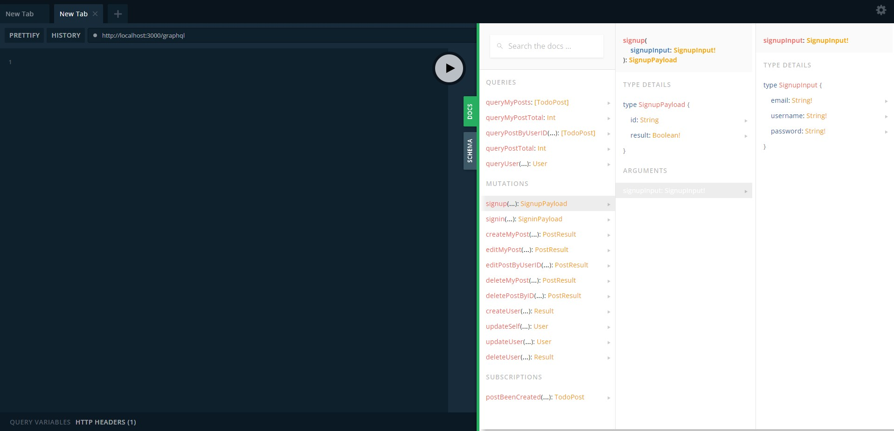
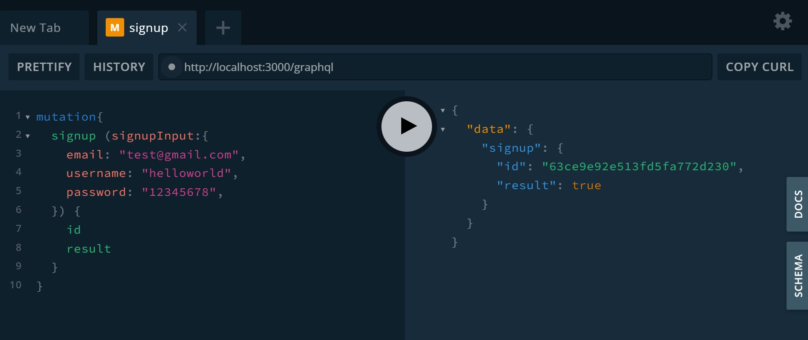
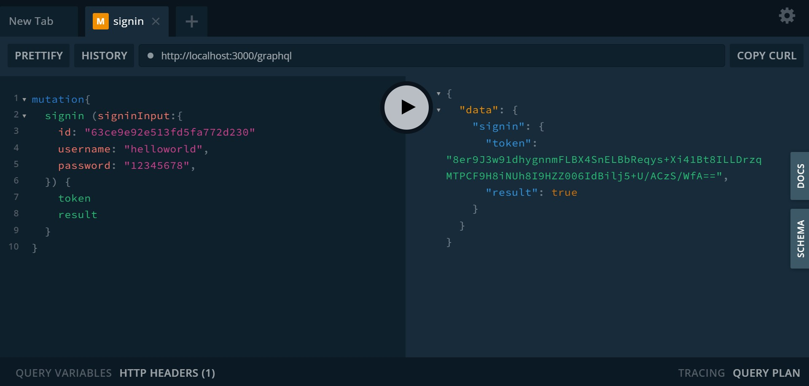
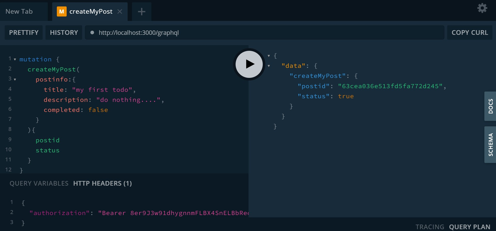
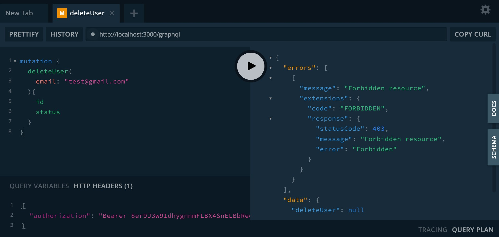

<p align="center">
  <a href="http://nestjs.com/" target="blank"></a>
</p>


Todo List管理服務
===
以Nestjs框架為基礎整合GraphQL、redis、Bear Token、MongoDB實作。

實作目的:
---
1. 以TodoList應用示範Nestjs框架整合GraphQL與Mongo資料庫套裝服務。
2. (Authentication) 結合Http Guard與Passport Strategy實作GraphQL下Token認證 
3. (Authorization) 結合CASL權限管理區分角色之間可以使用的功能
4. 結合Redis訂閱實作GraphQL的Subscription功能

<br>


詳細資訊
===
軟體版本:
* nodejs v16.16.0
* mongoose 6.7.2
* graphql 16.6.0


環境所需軟體:
* MongoDB 
* Redis

相關系統參數請至env/.env修改:
```
MONGODB_URI=mongodb://127.0.0.1:27017/testDB?directConnection=true
REDIS_URI=redis://127.0.0.1:6379
ROOT_USER_NAME=andrew
ROOT_USER_EMAIL=andrew@test.com
ROOT_USER_PASSWORD=12345678
```

<br>

安裝&運行:
===
```
npm install
npm run schema //編譯GraphQL成Schema結構檔
npm start
```
程式啟動後，瀏覽器輸入http://localhost:3000/graphql 可以開啟GraphQL PlayGround。   
點選右手邊Schema或DOCS瀏覽GraphQL API清單:


<br>

Demo Example:
===
1.signup一位使用者，建立user基本資料，建立成功可以獲取user id
```javascript
mutation{
  signup (
    signupInput:{
      email: "test@gmail.com",
      username: "helloworld",
      password: "12345678",
    }) {
      id
      result
    }
}
```


2.使用signin登入系統取得AccessToken (預設逾期時間為1小時)
```javascript
mutation{
  signin (
    signinInput:{
      id: "63ce9e92e513fd5fa772d230"
      username: "helloworld",
      password: "12345678",
    }) {
      token
      result
    }
}
```


3.後續可依據DOCS文件操作可使用的API，例如建立TODO List



4.CASL授權檢查會阻擋非法操作 (例如刪除其他使用者)



5.程式初始啟動會自動建立Admin帳號，可透過signin步驟取得admin AccessToken。

* * *
其他請參閱 GraphQL PlayGround DOCS。 

API List (Query/Mutation):
* signup
* signin
* createMyPost
* editMyPost
* editPostByUserID (Role: Admin)
* deleteMyPost 
* deletePostByID (Role: Admin)
* createUser
* updateSelf
* updateUser (Role: Admin)
* deleteUser (Role: Admin)
* queryMyPosts
* queryMyPostTotal
* queryPostByUserID (Role: Admin)
* queryPostTotal (Role: Admin)
* queryUser 

API List (Subscription):
* postBeenCreated (Role: Admin)

## License
[MIT licensed](LICENSE).
